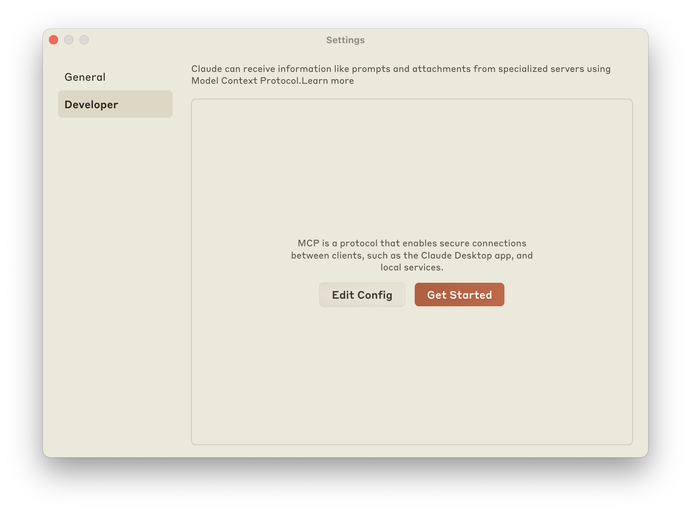
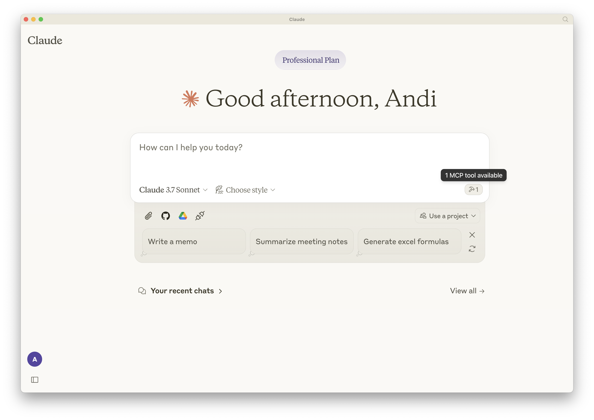
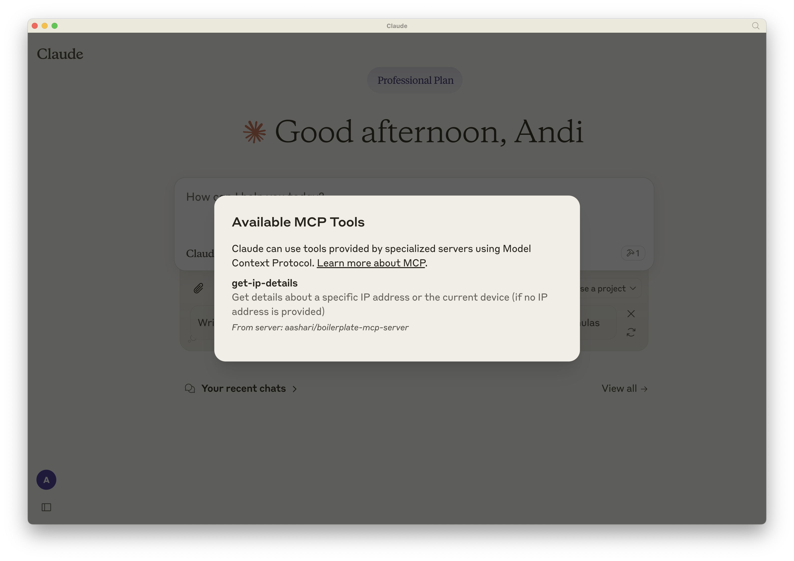
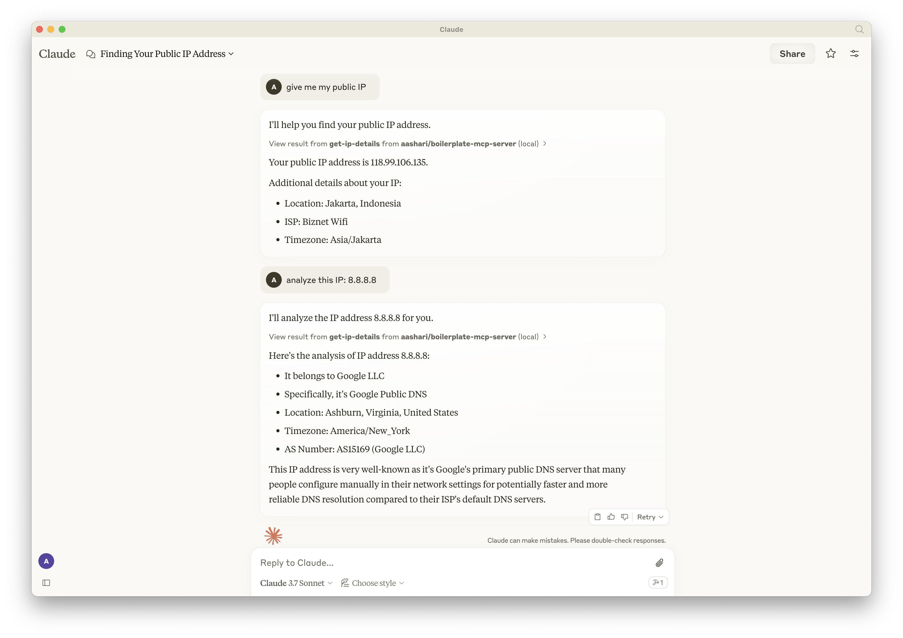

# Boilerplate MCP Server

A boilerplate Model Context Protocol (MCP) server implementation using TypeScript. This project demonstrates how to build a well-structured MCP server that exposes both tools and resources to AI applications like Claude Desktop. It serves as a starting point for developers building MCP-compatible servers with a focus on clean architecture, automated workflows, and easy deployment.

## About MCP

For detailed information about the Model Context Protocol (MCP), including core concepts, architecture, and implementation guides, please refer to the [official MCP documentation](https://modelcontextprotocol.io/docs/).

## Core Features

- **STDIO MCP Server**: Designed for AI clients like Claude Desktop, providing tools and resources via the Model Context Protocol.
- **CLI Support**: Human-friendly command-line interface for the same functionality, making it easy to test and use directly.
- **Automated Release Management**: GitHub Actions workflow for continuous integration, testing, and publishing to GitHub Packages.

## Running with npx

Run the server without local installation:

```bash
npx -y aashari/boilerplate-mcp-server
```

This command fetches the package directly from GitHub, runs `npm run build` (via `prepare` script), and executes the `mcp-server` command defined in `package.json`'s `bin` field. The `-y` flag skips prompts for a seamless experience.

> **Note**: This package is published to GitHub Packages, not the npm registry. The command format `npx username/repo` is used to fetch packages directly from GitHub repositories.

## Using as a CLI Tool

The package can also be used as a command-line tool for human interaction:

- **Get help and available commands**:
  ```bash
  npx -y aashari/boilerplate-mcp-server --help
  ```
  
  Example output:
  ```
  Usage: @aashari/boilerplate-mcp-server [options] [command]

  A boilerplate Model Context Protocol (MCP) server implementation using TypeScript

  Options:
    -V, --version               output the version number
    -h, --help                  display help for command

  Commands:
    get-ip-details [ipAddress]  Get details about a specific IP address or the current device
    help [command]              display help for command
  ```

- **Get current device IP details**:
  ```bash
  npx -y aashari/boilerplate-mcp-server get-ip-details
  ```
  
  Example output:
  ```
  status: success
  country: Indonesia
  countryCode: ID
  region: JK
  regionName: Jakarta
  city: Jakarta
  zip: 11730
  lat: -6.2114
  lon: 106.8446
  timezone: Asia/Jakarta
  isp: Biznet Wifi
  org: 
  as: AS17451 BIZNET NETWORKS
  query: 118.99.106.135
  ```

- **Get details for a specific IP address**:
  ```bash
  npx -y aashari/boilerplate-mcp-server get-ip-details 8.8.8.8
  ```
  
  Example output:
  ```
  status: success
  country: United States
  countryCode: US
  region: VA
  regionName: Virginia
  city: Ashburn
  zip: 20149
  lat: 39.03
  lon: -77.5
  timezone: America/New_York
  isp: Google LLC
  org: Google Public DNS
  as: AS15169 Google LLC
  query: 8.8.8.8
  ```

When run without arguments, the package starts the MCP Server for AI clients:
```bash
npx -y aashari/boilerplate-mcp-server
```

This will start the MCP server in STDIO mode, ready to communicate with AI clients like Claude Desktop.

## Setting Up with Claude Desktop

To use this MCP server with Claude Desktop:

1. **Open Claude Desktop Settings**:
   - Launch Claude Desktop
   - Click on the settings icon (gear) in the top-right corner
   
   

2. **Edit MCP Configuration**:
   - Click on "Edit Config" button
   - This will open File Explorer/Finder with the `claude_desktop_config.json` file

3. **Update Configuration File**:
   - Add the following configuration to the file:
   ```json
   {
     "mcpServers": {
       "aashari/boilerplate-mcp-server": {
         "command": "npx",
         "args": ["-y", "aashari/boilerplate-mcp-server"]
       }
     }
   }
   ```
   - Save the file

4. **Restart Claude Desktop**:
   - Close and reopen Claude Desktop to apply the changes
   
   

5. **Verify Tool Availability**:
   - On the Claude home page, look for the hammer icon on the right side
   - Click it to see available tools
   - Ensure the `get-ip-details` tool is listed
   
   

6. **Test the Tool**:
   - Try asking Claude: "give me my public IP" or "analyze this IP: 8.8.8.8"
   - Claude will use the MCP tool to fetch and display the requested information
   
   

## Prerequisites

- **Node.js**: v22.14.0 or higher (specified in `.node-version` and `package.json`).
- **npm**: Comes with Node.js, used for package management.

## Installation

Install dependencies locally:

```bash
npm install
```

This sets up the project with `@modelcontextprotocol/sdk` and development tools like `tsup`, `jest`, and `eslint`.

## Running Locally

Run the compiled JavaScript code:

```bash
npm start
```

This executes `node dist/index.cjs`, starting the MCP server with `stdio` transport.

## Project Structure

The project follows a clean architecture pattern with clear separation of concerns:

- **`src/index.ts`**: Main entry point, initializes the MCP server or CLI based on arguments.
- **`src/controllers/`**: Business logic (e.g., `ipaddress.controller.ts`).
- **`src/services/`**: External API integration (e.g., `vendor.ip-api.com.service.ts`).
- **`src/tools/`**: MCP tool definitions with Zod schemas (e.g., `ipaddress.tool.ts`).
- **`src/resources/`**: MCP resource definitions (e.g., `ipaddress.resource.ts`).
- **`src/cli/`**: CLI command definitions (e.g., `ipaddress.cli.ts`).
- **`src/utils/`**: Shared utilities (e.g., `logger.util.ts`).
- **`scripts/`**: Utility scripts (e.g., `update-version.js`).
- **`dist/`**: Compiled output (generated by `tsup`).

### Current Implementation

The server provides IP address functionality in three ways:

1. **Tool: `get-ip-details`**:

   - **Location**: `src/tools/ipaddress.tool.ts`
   - **Parameters**: Optional `ipAddress` (string).
   - **Functionality**: Returns IP details for a specified IP or the current device if none provided.
   - **Usage**: Callable by MCP clients.

2. **Resource: `Current Device IP`**:
   - **Location**: `src/resources/ipaddress.resource.ts`
   - **URI**: `ip://current`
   - **Functionality**: Exposes current device IP details as a text/plain resource.
   - **Usage**: Accessible as context by MCP hosts.

3. **CLI Command: `get-ip-details`**:
   - **Location**: `src/cli/ipaddress.cli.ts`
   - **Parameters**: Optional `ipAddress` argument.
   - **Functionality**: Displays IP details in the terminal for human users.
   - **Usage**: `npx -y aashari/boilerplate-mcp-server get-ip-details [ipAddress]`

**Data Flow**:

1. `ipaddress.controller.ts` orchestrates the logic for all three interfaces.
2. `vendor.ip-api.com.service.ts` fetches data from `http://ip-api.com/json`.
3. Results are formatted and returned to the client (MCP or CLI).

## Testing

Run unit tests:

```bash
npm test
```

Generate a test coverage report:

```bash
npm run test:coverage
```

Tests in `src/**/*.test.ts` verify controller and service functionality using Jest.

## Development

For detailed development instructions, including how to implement your own functionality, please refer to the [Development Guide](DEVELOPMENT.md).

## Creating Your Own MCP Server

This boilerplate is designed to be easily customized for your own MCP server. Here's how to get started:

### 1. Fork the Repository

Start by forking this repository to your own GitHub account.

### 2. Customize the Package Information

Update the package information in `package.json`:
- Change the `name` to your package name (e.g., `@yourusername/your-mcp-server`)
- Update the `description`, `repository`, `author`, and other fields
- Run `npm run update-version 1.0.0` to ensure all version references are updated

### 3. Implement Your Own Functionality

The boilerplate includes IP address lookup functionality as an example. To add your own functionality (e.g., weather information), follow the detailed steps in the [Development Guide](DEVELOPMENT.md).

## Version Management

Update the project version across `package.json`, `src/index.ts`, and CLI constants:

```bash
npm run update-version <new-version>
```

Example: `npm run update-version 1.2.0`. This script ensures version consistency, validated against SemVer format (e.g., `x.y.z`, `x.y.z-beta`).

## CI/CD with GitHub Actions

A GitHub Actions workflow (`.github/workflows/ci-cd.yml`) automates continuous integration and deployment:

### Continuous Integration

On every push to the `main` branch:

- Checks code formatting with `prettier --check`.
- Lints code with `eslint`.
- Builds with `tsup` to verify compilation.
- Runs unit tests with `jest`.

### Continuous Deployment

- Detects version changes in `package.json`.
- If changed:
  - Publishes to GitHub Packages (`@aashari/boilerplate-mcp-server`).
  - Creates and pushes a Git tag (e.g., `v1.2.0`).

This ensures the latest version is available on GitHub Packages, tagged in the repository, and ready for `npx -y` usage.

## Contributing

Contributions are welcome! Fork the repository, make changes, and submit a pull request to `main`. Ensure tests pass and formatting/linting standards are met.

## License

[ISC](https://opensource.org/licenses/ISC)
